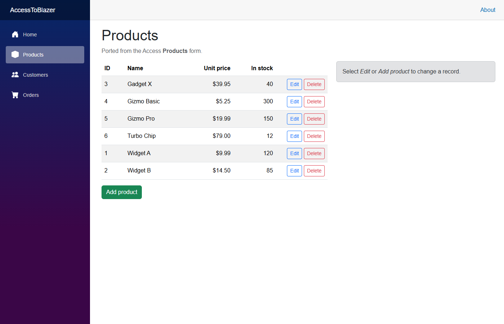
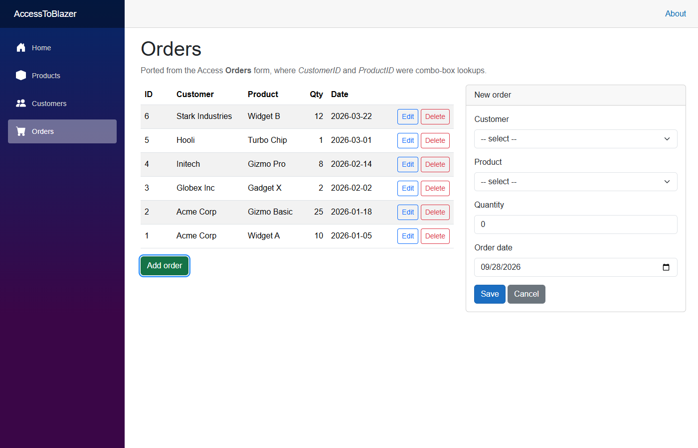
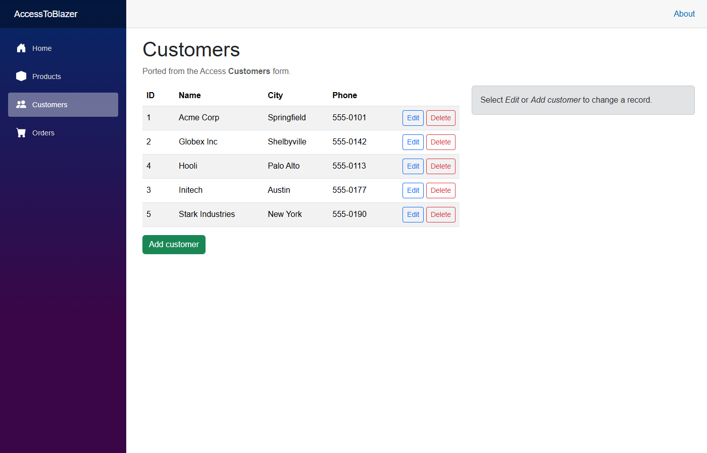

# AccessToBlazer - converting a classic Access database to Blazor Server

[](https://github.com/bobhuang1/AccessToBlazer/actions/workflows/ci.yml)

A complete, self-contained demonstration of porting an old **Microsoft Access
(MDB/ACCDB) database** to an **ASP.NET Core Blazor Server** application on
**.NET 10**, using **EF Core** against **SQL Server LocalDB**.

The repo contains both halves of the conversion, so you can compare them
side by side:

| | Before | After |
| --- | --- | --- |
| Code | `docs/AccessToBlazerSample.accdb` - an Access application | `src/AccessToBlazer.Web` - a Blazor Server project |
| Data | Access tables (`.mdb`/`.accdb` engine) | SQL Server tables, created by an EF Core migration |
| UI | Access bound forms | Razor components (`.razor`) |
| Runtime | The Access desktop app (.accdb) | A normal ASP.NET Core web app in a browser |

There is no proprietary code here. The Access file is generated from scratch by
`tools/New-SampleAccessDb.ps1`, and the Blazor app was written for this repo.

The domain is a small product catalogue with orders - deliberately generic. The
accessor is `docs/conversion-notes.md`, which maps every Access object to its
Blazor equivalent type by type.

## Screenshots

`/products` - the ported `Products` form, list plus inline editor:



`/orders` - the ported `Orders` form, with the editor open so the two converted
combo-box lookups (`Customer` and `Product`) are visible as `<InputSelect>`
dropdowns:



`/customers`:



## The old Access application

Three tables and three forms, no login, no macros, no VBA modules:

| Table | Fields | Rows |
| --- | --- | --- |
| `Products` | ProductID, ProductName, UnitPrice, UnitsInStock | 6 |
| `Customers` | CustomerID, CustomerName, City, Phone | 5 |
| `Orders` | OrderID, CustomerID, ProductID, Quantity, OrderDate | 6 |

`Orders.CustomerID` and `Orders.ProductID` are real Access relationships
(Referential Integrity enforced), which is why the seed data deliberately links
every customer and product to at least one order.

The three forms are `Products`, `Customers` and `Orders`. All three are
`RecordSource = SELECT * FROM <table>;` single-record forms with
`AllowAdditions`, `AllowEdits` and `AllowDeletions` all set to `True`.

## How the forms were converted

This is the heart of the port. An Access form is a bound window over a
`RecordSource` query; a Blazor component is markup plus code-behind. The
conversion is not a find-and-replace - each Access concept has to be
re-expressed in Razor.

**1. `RecordSource` becomes a query in `OnInitializedAsync`.**

An Access form binds itself to `SELECT * FROM Products;` and displays whatever
rows that returns. The Blazor equivalent loads the same rows explicitly and
binds them to a table:

```razor
@code {
    private List<Product> products = new();

    protected override async Task OnInitializedAsync() => await LoadAsync();

    private async Task LoadAsync()
    {
        await using var db = await DbFactory.CreateDbContextAsync();
        products = await db.Products.OrderBy(p => p.ProductName).ToListAsync();
    }
}
```

`AllowDeletions/Additions/Edits = True` in Access simply meant the built-in
record toolbar was live. In Blazor there is no such toolbar, so each operation
became an explicit button calling an async method.

**2. Single-record `DefaultView` became a list + inline editor.**

Access's `DefaultView = acNormal` shows one record at a time with a navigation
bar. A web page has no equivalent implicit navigation, so each ported form is a
two-column Bootstrap layout:

- **left** - all rows in a `<table>`, each with `Edit` and `Delete` buttons
  (this is Access's record navigation, made visible);
- **right** - a single `<EditForm>` that edits the selected row, or a blank one
  when you press *Add*.

This is the one place the port is deliberately *not* a pixel copy. A list-plus-editor
is what a multi-user web app should look like; a one-record-at-a-time form
scrolling to a page per record would be a downgrade on the web.

**3. Every bound text box became an `InputText` / `InputNumber` / `InputDate`.**

`Products` form, control by control:

| Access control | Control source | Blazor equivalent |
| --- | --- | --- |
| `Text0` | `ProductID` | read-only cell in the table (see note below) |
| `Label1` | - | `<th>` / `<label>` |
| `Text2` | `ProductName` | `<InputText @bind-Value="editing.ProductName" />` |
| `Label3` | - | `<label class="form-label">` |
| `Text4` | `UnitPrice` | `<InputNumber @bind-Value="editing.UnitPrice" />` |
| `Label5` | - | `<label class="form-label">` |
| `Text6` | `UnitsInStock` | `<InputNumber @bind-Value="editing.UnitsInStock" />` |
| `Label7` | - | `<label class="form-label">` |

`Customers` is identical in shape: `CustomerID`, `CustomerName` (`InputText`),
`City` (`InputText`), `Phone` (`InputText`).

The `ProductID` / `CustomerID` / `OrderID` text box deserves a note. In Access
it was bound to a `COUNTER` (AutoNumber) field, so Access let the user type over
it. In the port the key is `IDENTITY(1,1)` in SQL Server, assigned by the
database, and is **not** an editable control - the page treats `0` as "new row"
and displays the generated id read-only. Editing an identity column by hand is
something you do not want in a web app.

**4. The two combo boxes became `<InputSelect>` dropdowns.**

The `Orders` form is the interesting one, because it is the only form with
lookups. Its two `ComboBox` controls were fed by embedded SELECT queries:

| Access control | Control source | Access `RowSource` |
| --- | --- | --- |
| `Combo2` | `CustomerID` | `SELECT CustomerID, CustomerName FROM Customers ORDER BY CustomerName;` |
| `Combo4` | `ProductID` | `SELECT ProductID, ProductName FROM Products ORDER BY ProductName;` |

Both became `<InputSelect>` elements whose options are rendered from a list
loaded by the same query, preserving the `ORDER BY`:

```razor
@foreach (var product in products)
{
    <option value="@product.ProductId">@product.ProductName</option>
}
```

The order list also has to *show* the names rather than the raw ids, so it
eager-loads the related rows with `.Include(o => o.Customer).Include(o => o.Product)` -
the Blazor equivalent of the Access form's display of the lookup column.

One small addition: each `<InputSelect>` starts with a `-- select --` option
bound to `0`, so the form can be saved in an "unset" state. Access's combo boxes
had no such sentinel value; here `[Range(1, int.MaxValue)]` on `CustomerId` and
`ProductId` rejects `0` with "Select a customer." / "Select a product."

**5. Validation moved from field properties to DataAnnotations.**

Access `Required` / validation rules on controls are expressed in the port as
C# attributes on the model (`[Required]`, `[Range]`, `[StringLength]`), rendered
by `<DataAnnotationsValidator />` and `<ValidationMessage For="...">`. Because
validation lives on the model, it applies identically to the form and to any
future API endpoint.

**6. Referential integrity got an explicit, friendly message.**

Because `Orders` references `Products` and `Customers`, deleting a row that is
still in use fails. In Access this is a raw "record cannot be deleted" error
dialog. In the port, the delete handlers check first and report it in the page:

> Cannot delete "Acme Corp": 2 order(s) still reference it. Delete those orders
> first.

The same check protects both the `Products` and `Customers` pages.

**7. No VBA meant no event logic to port.**

The Access app has **zero VBA modules** and no macros, so none of the forms
carry `OnClick`/`AfterUpdate` code to translate. That is a large part of why
this port is small: a real Access app with macros is where the effort goes.
The one behaviour Access *did* have implicitly - referential integrity - is
reproduced explicitly in step 6.

## The table and type conversion

| Access | SQL Server (EF Core) | C# |
| --- | --- | --- |
| `COUNTER` (AutoNumber) | `int` + `IDENTITY(1,1)` | `int` with `[Key]` |
| `TEXT(n)` | `nvarchar(n)` | `string` |
| `CURRENCY` | `decimal(18,2)` | `decimal` |
| `INTEGER` (Long) | `int` | `int` |
| `DATETIME` | `datetime2` | `DateTime` |
| Relationship (enforced) | Foreign key + `DeleteBehavior.Restrict` | `Customer.Orders` / `Product.Orders` navigation |

The data survives the move unchanged. The EF migration inserts the same six
products, five customers and six orders, with the same ids as the `.accdb`, so
you can open both and see identical content.

## Blazor Server specifics

- The app registers `IDbContextFactory<SampleDbContext>` and creates a
  short-lived context per operation. A single shared `DbContext` would leak its
  change tracker across every user's long-lived circuit.
- The database is created, migrated and seeded automatically on first run, so
  there is no manual setup.
- There is **no authentication**, matching the original Access app, which had
  no login form.

## How to run

Needs the **.NET 10 SDK** and **SQL Server Express LocalDB** (both ship with
Visual Studio; LocalDB is also a standalone download from Microsoft).

```bash
git clone https://github.com/bobhuang1/AccessToBlazer.git
cd AccessToBlazer
dotnet run --project src/AccessToBlazer.Web
```

Open the URL the console prints (by default <http://localhost:5000>). There is
no login. To reset the data, drop the database and start again:

```powershell
sqlcmd -S "(localdb)\MSSQLLocalDB" -Q "DROP DATABASE AccessToBlazerSample;" -C
```

The connection string is `ConnectionStrings:SampleDb` in
`src/AccessToBlazer.Web/appsettings.json`; point it at any SQL Server you like.

## The schema as a SQL script

`docs/schema.sql` is the database schema, generated from the EF Core migration
rather than written by hand:

```bash
dotnet ef migrations script --project src/AccessToBlazor.Web \
  --context SampleDbContext --output docs/schema.sql
```

It contains the three `CREATE TABLE` statements, the two foreign keys
(`ON DELETE NO ACTION`, i.e. EF's `DeleteBehavior.Restrict`) and the seed rows
via `SET IDENTITY_INSERT`, so the ids match the `.accdb` exactly. The app applies
all of this for you on startup; the script is there for inspecting the schema or
provisioning a database by hand:

```powershell
sqlcmd -S "(localdb)\MSSQLLocalDB" -Q "CREATE DATABASE AccessToBlazerSample;" -C
sqlcmd -S "(localdb)\MSSQLLocalDB" -d AccessToBlazerSample -i docs/schema.sql -C
```

It is a plain script, not an idempotent one - it will fail if run twice against
the same database. Regenerate it rather than editing it.

To see the "before" side, open `docs/AccessToBlazerSample.accdb` in desktop
Access (no macros, no VBA, no login). To regenerate it from scratch, run
`tools/New-SampleAccessDb.ps1` (requires desktop Access).

## Project layout

```
AccessToBlazer/
|-- .github/workflows/ci.yml         build + Windows LocalDB smoke test
|-- docs/
|   |-- AccessToBlazerSample.accdb   the original Access app (3 tables, 3 forms)
|   |-- schema.sql                   the SQL Server schema + seed, generated from the migration
|   |-- conversion-notes.md          object-by-object and type-by-type mapping
|   `-- screenshots/                 pages of the ported app
|-- src/AccessToBlazer.Web/
|   |-- Data/SampleDbContext.cs      EF Core context, relationships, seed data
|   |-- Models/                      Product, Customer, Order
|   |-- Migrations/                  InitialCreate
|   `-- Components/Pages/            Home, Products, Customers, Orders
|-- tools/New-SampleAccessDb.ps1     regenerates the .accdb by automation
`-- LICENSE                          MIT
```

## Continuous integration

`.github/workflows/ci.yml` runs on every push and pull request:

- **Build** (ubuntu) - restore and build the solution in Release, 0 warnings
  expected.
- **Smoke test** (windows) - runs the app against SQL Server LocalDB and
  requests `/`, `/products`, `/customers` and `/orders`, then asserts the seed
  data is present. Because the app creates and migrates its own database on
  startup, this catches a broken migration or a missing seed, which a plain
  build cannot.

## Scope and limitations

This is a **sample**, not a production migration template. It deliberately
leaves out what makes a real conversion hard:

- No authentication or authorization (the Access app had none either).
- No VBA, no macros, no event-driven form logic to translate.
- No lookup/report queries beyond the two combo-box `RowSource` SELECTs, and no
  subforms.
- No undo, no optimistic concurrency, no audit trail.
- No deployment/IIS configuration and no load testing.

A real port adds those one at a time on top of exactly this structure. The
hardest parts in practice are the macros, the business rules buried in form
events, and referential-integrity behaviour that Access handled implicitly.

## License

This project is free software, released under the **GNU General Public License v3.0**. You may redistribute and/or modify it under those terms; see [LICENSE.md](LICENSE.md) for the full text.
